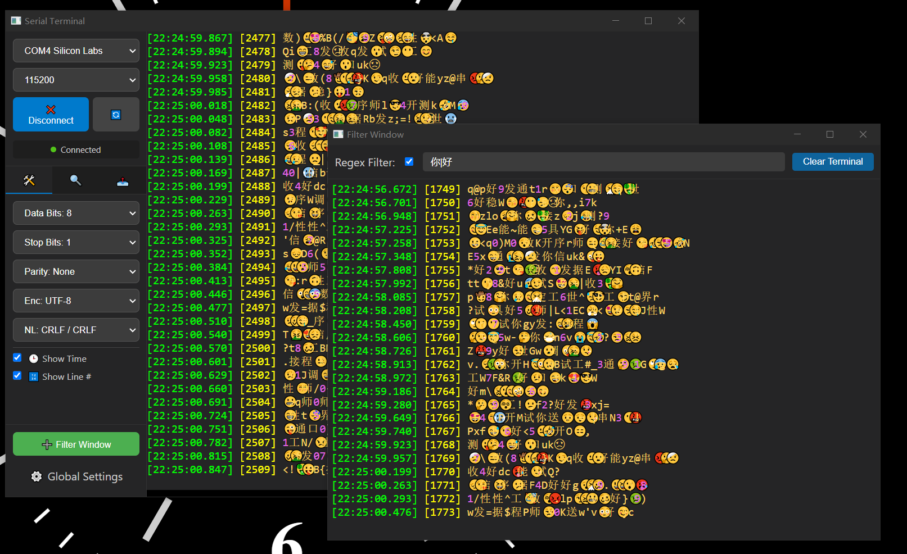

#  Serial Terminal

A modern, cross-platform serial port terminal application built with Electron, designed for developers and embedded systems engineers.



## 📖 Introduction

Serial Terminal is a robust and user-friendly tool for communicating with serial devices. Whether you are debugging Arduino projects, configuring network equipment, or working with industrial microcontrollers, this application provides a stable and feature-rich environment.

It combines the power of **xterm.js** for terminal emulation with the flexibility of Electron, offering features like custom baud rates, real-time logging, and powerful text processing capabilities.

## ✨ Features

*   **🔌 robust Serial Communication**:
    *   Support for standard and custom baud rates.
    *   Configurable Data bits, Stop bits, Parity, and Flow Control (RTS/CTS, XON/XOFF).
    *   Automatic port detection and refresh.

*   **💻 Professional Terminal Emulation**:
    *   Full-featured terminal interface powered by **xterm.js**.
    *   Supports ANSI escape sequences for colored text and cursor positioning.
    *   Search functionality within the terminal buffer.

*   **🚀 Advanced Send Functions**:
    *   **Auto Send**: Periodically send commands with customizable intervals.
    *   **Quick Send**: Customizable sidebar for frequently used commands. Supports editing, reordering, and multi-line payloads.

*   **📝 Comprehensive Logging**:
    *   **Smart Buffering**: Logs are buffered in memory and flushed to disk efficiently to protect your drive's lifespan.
    *   Timestamps and direction indicators (TX/RX) for all data.
    *   Customizable log file naming and storage location.

*   **🎨 Visualization & Filtering**:
    *   **Keyword Highlighting**: Highlight important text (like "ERROR", "WARNING") using Regular Expressions (Regex) with custom colors.
    *   **Filter Window**: A dedicated window to isolate lines matching specific patterns, keeping your main view clean.

*   **⚙️ Customization**:
    *   Dark/Light theme support (UI follows system or custom settings).
    *   Adjustable font family, size, and line height.
    *   Settings are automatically saved and restored.

*   **🛠️ Cross-Platform**:
    *   Optimized for Windows and Linux.
    *   Portable executable options available.

## 🚀 Getting Started

### Prerequisites

*   **Node.js**: v16.x or higher is recommended.
*   **Build Tools**: Since this project uses native modules (`serialport`, `node-pty`), you need build tools installed on your system.
    *   **Windows**: Install Visual Studio Build Tools (C++ workload) or run `npm install --global --production windows-build-tools`.
    *   **Linux**: Install `build-essential` and python (e.g., `sudo apt-get install build-essential python3`).

### Installation

1.  **Clone the repository**
    ```bash
    git clone https://github.com/Trigger-CN/SerialTerminal.git
    cd SerialTerminal
    ```

2.  **Install dependencies**
    ```bash
    npm install
    ```
    *Note: This will also attempt to build the native modules. If it fails, ensure your build tools are set up correctly.*

## 🏃 Running in Development Mode

To start the application with hot-reload (if configured) or in standard debug mode:

```bash
npm start
```

This command runs `electron .` to launch the application from the source code.

## 📦 Packaging & Building

Use `electron-builder` to create distributable installers or executables for your platform.

### For Windows
Creates an NSIS installer and a Portable executable in the `dist/` directory.

```bash
npm run dist:win
```

### For Linux
Creates an AppImage and a .deb package in the `dist/` directory.

```bash
npm run dist:linux
```

> **Note**: Native modules (like `serialport`) must be compiled for the target platform. It is highly recommended to build the Windows version on a Windows machine and the Linux version on a Linux machine to avoid complex cross-compilation issues.

## ❓ Troubleshooting

**"Module not found" or "DLL initialization failed"**
This usually happens if native modules weren't compiled against the Electron version correctly.
Run the rebuild script:
```bash
npm run rebuild
```

**Serial Port not showing up**
*   Check if you have the necessary drivers installed for your USB-to-Serial converter (CH340, CP210x, FTDI, etc.).
*   Click the refresh button in the application connection panel.

## 📄 License

MIT License
