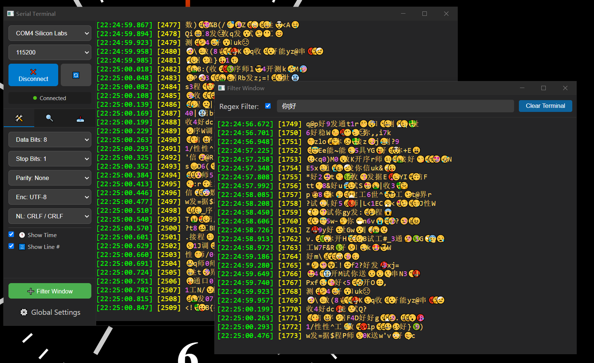

#  Serial Terminal

一个基于 Electron 的串口终端工具，面向嵌入式开发、串口调试和设备联调场景，提供终端显示、发送自动化、日志记录、关键词高亮和多标签过滤等能力。



## 简介

Serial Terminal 使用 Electron 构建桌面应用，串口通信基于 `serialport`，终端显示基于 `xterm.js`。当前项目以串口调试为核心，界面分为主串口终端、侧边栏工具区和全局设置窗口。

应用支持常见串口参数配置、文本编码切换、自动发送、快捷发送、日志落盘、关键词高亮、搜索以及多过滤标签页，适合用于调试单片机、模组、工业设备和各类串口外设。

## 当前功能

### 串口连接

- 自动枚举本机串口并支持手动刷新
- 支持标准波特率和自定义波特率
- 支持数据位、停止位、校验位配置
- 支持接收/发送换行模式切换：CRLF / LF / CR
- 连接后自动保存最近一次串口参数，便于下次恢复

### 终端显示

- 基于 `xterm.js` 的终端显示区域
- 支持可配置滚动缓冲区大小
- 支持显示时间戳和行号
- 支持清空当前活动终端内容
- 支持终端内 Ctrl+C 复制、Ctrl+V 粘贴

### 搜索与过滤

- 主终端内支持搜索
- 支持普通文本、正则、区分大小写、整词匹配
- 支持创建多个过滤标签页
- 每个过滤标签页可独立设置过滤条件
- 过滤条件支持正则与大小写控制
- 自动保存过滤历史，并可通过下拉快速复用
- 过滤结果会对命中文本进行高亮显示

### 发送能力

- 支持直接在终端输入并发送到串口
- 支持自动发送，可配置发送内容和时间间隔
- 支持快捷发送列表
- 快捷发送项支持新增、编辑、删除
- 快捷发送内容支持多行文本

### 高亮与外观

- 可配置终端字体、字号、前景色、背景色
- 可配置时间戳颜色和行号颜色
- 支持多条关键词高亮规则
- 每条高亮规则支持：启用/禁用、颜色、大小写、正则模式

### 日志与配置

- 支持自动记录串口/终端数据
- 支持自定义日志目录、文件名格式和编码
- 日志在内存中缓冲，并在断开连接或退出前写入文件
- 所有全局配置保存在用户目录下的 `config.json`
- 支持打开配置目录和一键恢复默认设置

### 更新与发布

- 集成 `electron-updater`
- 支持在设置页检查更新、下载更新并重启安装
- 使用 `electron-builder` 打包 Windows 与 Linux 发布物

## 项目结构

```text
.
├─ assets/               图标与截图资源
├─ test/                 Python 串口测试脚本
├─ index.html            主窗口界面
├─ renderer.js           渲染进程逻辑（串口 UI、过滤、搜索、发送）
├─ main.js               主进程逻辑（窗口、配置、串口、日志、更新）
├─ preferences.html      设置窗口界面
├─ preferences.js        设置窗口逻辑
├─ style.css             全局样式
├─ serial_tester.py      串口测试工具
├─ package.json          依赖、脚本与打包配置
└─ release-notes.md      发布说明
```

## 技术栈

- Electron
- serialport
- xterm.js
- electron-builder
- electron-updater
- iconv-lite
- node-pty

## 开发环境要求

- Node.js 16+
- npm
- 由于项目依赖原生模块，首次安装通常需要本机具备编译环境

### Windows

建议安装 Visual Studio Build Tools（C++ workload）。

### Linux

建议安装 `build-essential` 与 `python3`。

## 安装依赖

```bash
npm install
```

安装后会自动执行 `electron-builder install-app-deps`，用于处理 Electron 原生依赖。

## 本地运行

```bash
npm start
```

## 常用脚本

### 重新编译原生模块

```bash
npm run rebuild
```

### 构建当前平台发行包

```bash
npm run dist
```

### 构建 Windows 包

```bash
npm run dist:win
```

### 构建 Linux 包

```bash
npm run dist:linux
```

## 配置说明

程序运行时会在用户数据目录中生成配置文件：

- 配置文件：`config.json`
- 默认日志目录：用户文档目录下的 `SerialTerminalLogs`

当前配置主要包括：

- 外观设置
- 高亮规则
- 日志设置
- 滚动与历史缓冲区大小
- 自动发送设置
- 快捷发送列表
- 最近一次串口连接参数
- 过滤历史

## 测试与辅助脚本

仓库中包含用于串口调试/验证的 Python 脚本：

- `serial_tester.py`
- `test/serial_test.py`

这些脚本更适合作为联调辅助工具，当前项目本身没有完整的前端自动化测试体系。

## 已知实现特点

- 主窗口通过渲染进程直接使用 Electron/Node API，当前开启了 `nodeIntegration`
- 过滤视图已从独立窗口改为主界面中的多标签模式
- 清空按钮只清理当前激活标签页内容，不会清除全部过滤页
- 日志采用内存缓冲后写盘，而不是逐条实时落盘

## 适用场景

- MCU / 开发板串口调试
- AT 指令交互
- 设备日志查看与关键字过滤
- 串口协议开发过程中的快速发送与重复命令测试
- 需要桌面端图形界面的串口联调工具替代方案

## License

MIT
