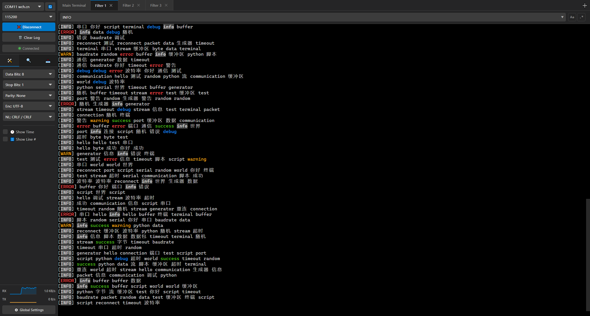

#  Serial Terminal

一个基于 Electron 的桌面串口终端工具，面向嵌入式开发、串口调试、设备联调、日志查看与关键字过滤场景。当前版本已支持主串口终端、过滤标签页、分屏工作区、Shell 标签页、多标签独立日志、多语言和在线更新。



## 简介

Serial Terminal 使用 Electron 构建桌面应用，串口通信基于 `serialport`，终端显示基于 `xterm.js`。应用以单串口调试为核心，在同一主界面中集成：

- 主串口终端
- 多个过滤标签页
- 最多 2 个 pane 的分屏工作区
- 系统 Shell 标签页
- 左侧侧边栏工具区
- 右侧 Shell 侧边栏
- 独立设置窗口

适合用于 MCU、模组、工业设备、AT 指令、协议联调与日志筛选分析等场景。

## 当前功能

### 串口连接与通信

- 自动枚举本机串口并支持手动刷新
- 支持标准波特率和自定义波特率
- 支持数据位、停止位、校验位配置
- 支持接收/发送换行模式切换：`CRLF / LF / CR`
- 支持编码切换：`UTF-8 / ASCII / Hex / GBK`
- 连接后自动保存最近一次串口参数，便于下次恢复
- 主终端支持像普通终端一样直接键入并逐键发送到串口

### 主终端与工作区

- 基于 `xterm.js` 的主终端显示区域
- 支持显示时间戳和行号
- 支持可配置滚动缓冲区大小
- 支持左右分屏与上下分屏
- 首版最多支持 2 个 pane
- 每个 pane 内支持独立 tabs
- 支持在 pane 之间移动过滤标签页与 Shell 标签页
- 支持拖动 pane 分隔条调整区域比例
- 工作区布局会自动持久化，并在下次启动时恢复

### 过滤标签页

- 支持创建多个过滤标签页
- 每个过滤标签页拥有独立的：
  - 过滤文本输入框
  - 区分大小写开关
  - 正则开关
  - 终端显示区
- 支持过滤历史下拉复用
- 支持关闭应用后恢复已打开的过滤标签页
- 支持恢复过滤条件、大小写、正则状态和所属 pane
- 过滤结果会对命中文本进行高亮显示

### 搜索

- 主终端、过滤标签页、Shell 标签页都可作为搜索目标
- 搜索目标跟随当前活动 pane 的活动 tab
- 支持普通文本、正则、区分大小写、整词匹配
- 左侧搜索面板显示当前匹配序号 / 总匹配数
- 匹配数基于本地终端 buffer 统计

### 发送能力

- 支持直接在主终端输入并发送串口数据
- 支持底部主输入框发送
- 主输入框支持：
  - 发送按钮
  - 将当前输入加入快捷发送
  - 历史命令记录
  - 上下键切换历史命令
  - 按回车发送开关
  - 发送时末尾自动追加 `CRLF` 开关
- 发送后输入框内容不会自动清空
- 保留左侧自动发送能力，可配置内容和时间间隔
- 支持快捷发送列表
- 快捷发送项支持新增、编辑、删除、拖动排序
- 快捷发送顺序会自动持久化

### Shell 标签页

- 支持在工作区中新建系统 Shell 标签页
- 每个 Shell 标签页对应独立的 `node-pty` 会话
- 支持在两个 pane 中创建、切换、移动、关闭 Shell 标签页
- 支持右侧 Shell 侧边栏显示当前活跃会话
- 支持自定义 Shell Profiles：
  - 名称
  - 可执行文件路径
  - 启动参数
  - Shell 类型
- 支持设置默认 Shell Profile
- 当前默认内置 `CMD` 和 `PowerShell`
- Shell 标签页状态和布局可恢复，进程会在启动时重新创建

### 右键菜单

- 主终端、过滤标签页、Shell 标签页均支持右键菜单
- 已支持的常用操作包括：
  - 复制
  - 复制全部
  - 查找选中内容
  - 清空当前终端
- 主终端额外支持：
  - 粘贴并发送
  - 发送选中内容
  - 基于选中文本新建过滤标签页
- 过滤标签页额外支持：
  - 用选中文本作为过滤条件
  - 将选中文本追加到过滤条件
  - 在主终端中定位
  - 切换区分大小写
  - 切换正则
  - 关闭过滤标签页
- Shell 标签页支持基础会话相关操作，如关闭和重启

### 高亮与外观

- 可配置终端字体、字号、前景色、背景色
- 可配置时间戳颜色和行号颜色
- 支持多条关键词高亮规则
- 每条高亮规则支持：
  - 启用 / 禁用
  - 颜色
  - 大小写控制
  - 正则模式
- 支持系统字体列表选择
- 支持鼠标滚轮滚动行数配置

### 日志与配置

- 支持自动记录串口/终端数据
- 支持自定义日志目录、文件名格式和编码
- 日志在内存中缓冲，并在断开连接、关闭标签页或退出前写入文件
- 支持将所有标签页日志分别保存到独立文件
- 日志文件名格式支持：
  - `%Y %m %d %H %M %S`
  - `%tab`（标签页标题，仅多标签日志场景）
- 主终端、过滤标签页、Shell 标签页都可分别写入独立日志文件
- 所有全局配置保存在用户目录下的 `config.json`

### 多语言

当前内置语言：

- English
- 简体中文
- 繁體中文
- Français
- Русский
- Deutsch

主界面、设置窗口、输入区、右键菜单和更新提示均支持多语言文案。

### 更新与发布

- 集成 `electron-updater`
- 应用启动时自动检查更新
- 支持手动检查更新
- 发现新版本时支持：
  - 立即更新
  - 暂不更新
  - 跳过此版本
- 下载完成后支持重启安装或稍后安装
- 更新提示会尝试显示 GitHub Release 正文；获取不到时提示网络异常
- 使用 `electron-builder` 打包 Windows 与 Linux 发布物

## 项目结构

```text
.
├─ assets/                    图标与截图资源
├─ scripts/                   辅助脚本
├─ test/                      Python 串口测试脚本
│  ├─ serial_test.py
│  └─ serial_tester.py
├─ index.html                 主窗口界面
├─ renderer.js                主窗口渲染逻辑（终端、过滤、搜索、输入、Shell）
├─ workspace-manager.js       工作区 pane/tab 布局管理
├─ main.js                    主进程逻辑（窗口、配置、串口、日志、更新、Shell PTY）
├─ preferences.html           设置窗口界面
├─ preferences.js             设置窗口逻辑
├─ i18n.js                    多语言字典与翻译函数
├─ style.css                  全局样式
├─ agent_notes.md             项目接手与维护说明
├─ package.json               依赖、脚本与打包配置
└─ README.md                  项目说明
```

## 技术栈

- Electron
- serialport
- @xterm/xterm
- @xterm/addon-fit
- @xterm/addon-search
- iconv-lite
- node-pty
- electron-builder
- electron-updater
- electron-log
- font-list

## 开发环境要求

- Node.js 16+
- npm
- 由于项目依赖原生模块，首次安装通常需要本机具备编译环境

### Windows

建议安装 Visual Studio Build Tools（C++ workload）。

### Linux

建议安装 `build-essential` 与 `python3`。

## 安装依赖

```bash
npm install
```

安装后会自动执行 `electron-builder install-app-deps`，用于处理 Electron 原生依赖。

## 本地运行

```bash
npm start
```

## 常用脚本

### 重新编译原生模块

```bash
npm run rebuild
```

### 构建当前平台发行包

```bash
npm run dist
```

### 构建 Windows 包

```bash
npm run dist:win
```

### 构建 Linux 包

```bash
npm run dist:linux
```

建议正式发版时在 GitHub Release 中填写版本说明。应用更新提示优先读取线上 Release 正文。

## 配置说明

程序运行时会在用户数据目录中生成配置文件：

- 配置文件：`config.json`
- 默认日志目录：用户文档目录下的 `SerialTerminalLogs`

当前配置主要包括：

- 外观设置
- 高亮规则
- 日志设置
- 滚动缓冲区与历史缓冲区大小
- 鼠标滚轮滚动行数
- 自动发送设置
- 快捷发送列表
- 最近一次串口连接参数
- 过滤历史
- 过滤标签页状态
- Shell 标签页状态
- Shell Profiles
- 默认 Shell Profile
- 主输入框设置
- 工作区分屏布局
- 跳过的更新版本号

## 测试与辅助脚本

仓库中包含用于串口调试/验证的 Python 脚本：

- `test/serial_test.py`
- `test/serial_tester.py`

这些脚本更适合作为联调辅助工具，当前项目本身没有完整的前端自动化测试体系。

## 已知实现特点

- 当前主窗口启用了 `nodeIntegration: true` 且 `contextIsolation: false`
- 项目当前以单串口连接模型为核心，不支持同时连接多个物理串口
- 分屏工作区首版最多支持 2 个 pane
- 过滤标签页与 Shell 标签页恢复的是 UI 状态，不恢复上次进程内部运行上下文
- 日志采用内存缓冲后写盘，而不是逐条实时落盘

## 适用场景

- MCU / 开发板串口调试
- AT 指令交互
- 设备日志查看与关键字过滤
- 串口协议开发过程中的快速发送与重复命令测试
- 需要桌面端图形界面的串口联调工具替代方案

## License

ISC
